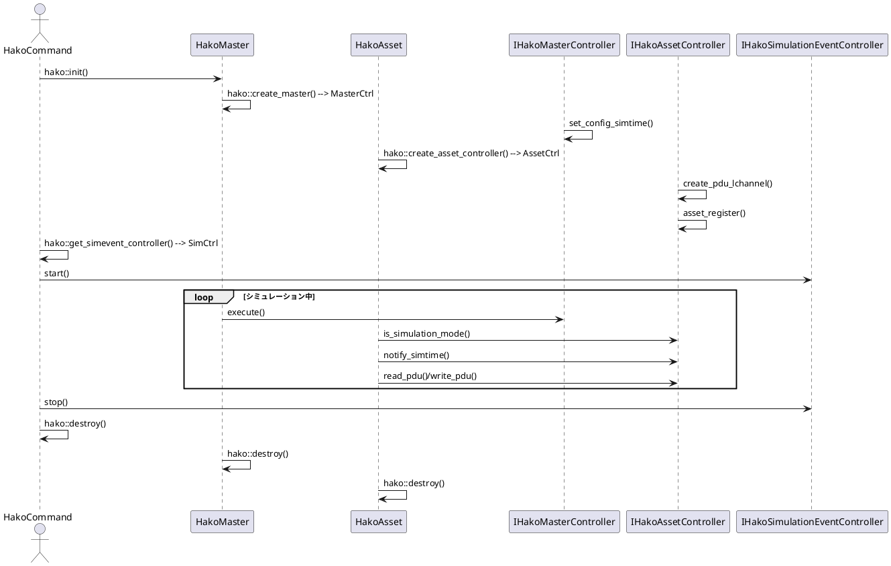

# hakoniwa-core-cpp

Hakoniwa-core-cpp は **シミュレーションハブの本体** となるコアライブラリです。共有メモリを利用したスタック構造により、アセット間で高速な PDU データ通信と時刻同期を実現しています。

## Documentation
- [API Specification](API_SPEC.md)
- [Shared Memory Layout](SHARED_MEMORY_SPEC.md)

## Stack Overview
1. Shared memory layer manages master data and PDU buffers.
2. Controller interfaces (master / asset / event) provide the public API.
3. Sample processes under `sample/` demonstrate typical usage.

## Simulation Flow
The following sequence diagram outlines how each component interacts during a
typical run. PlantUML can be used to render the diagram.

## Required
- If Using Google Test
  - sudo apt-get install libgtest-dev
