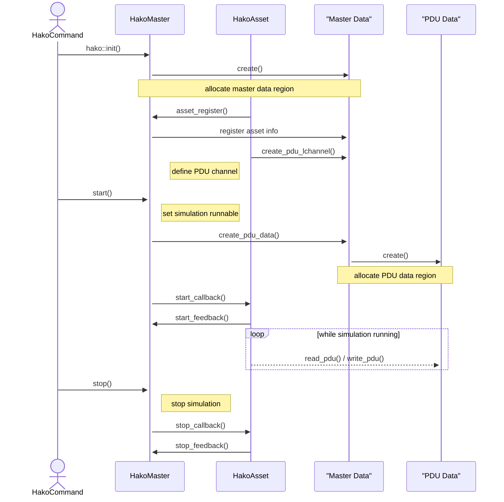

# hakoniwa-core-cpp (English)

Hakoniwa-core-cpp is the **core library of the simulation hub**. It uses a shared memory stack to achieve fast PDU communication and time synchronization between assets.

## Documentation
- [API Specification](API_SPEC_EN.md)
- [Shared Memory Layout](SHARED_MEMORY_SPEC_EN.md)

## Stack Overview
1. Shared memory layer manages master data and PDU buffers.
2. Controller interfaces (master / asset / event) provide the public API.
3. Sample processes under `sample/` demonstrate typical usage.

## Simulation Flow
The following sequence diagram outlines how each component interacts during a typical run.

## Required
- If Using Google Test
  - sudo apt-get install libgtest-dev
